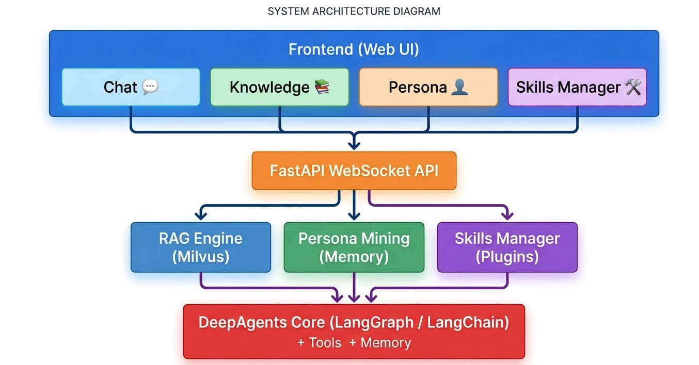
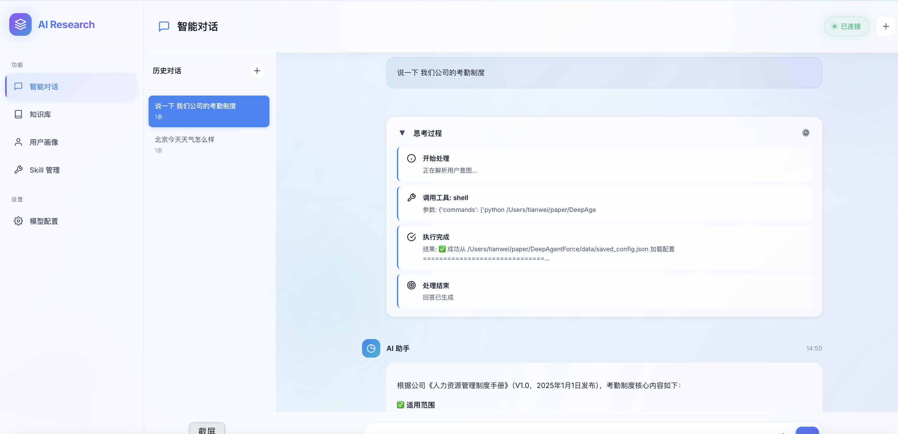
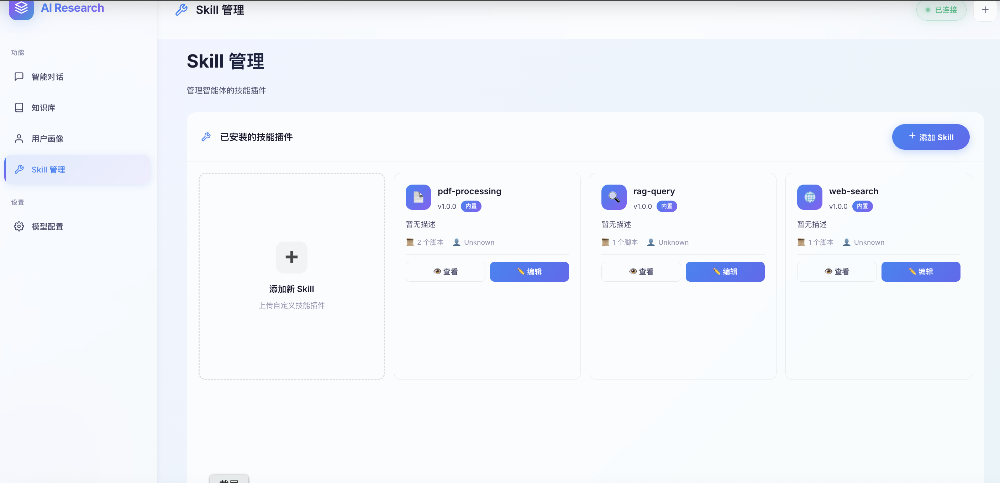
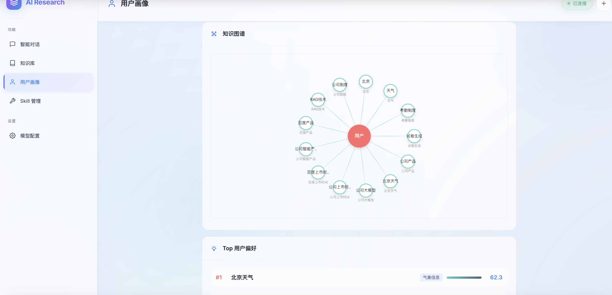
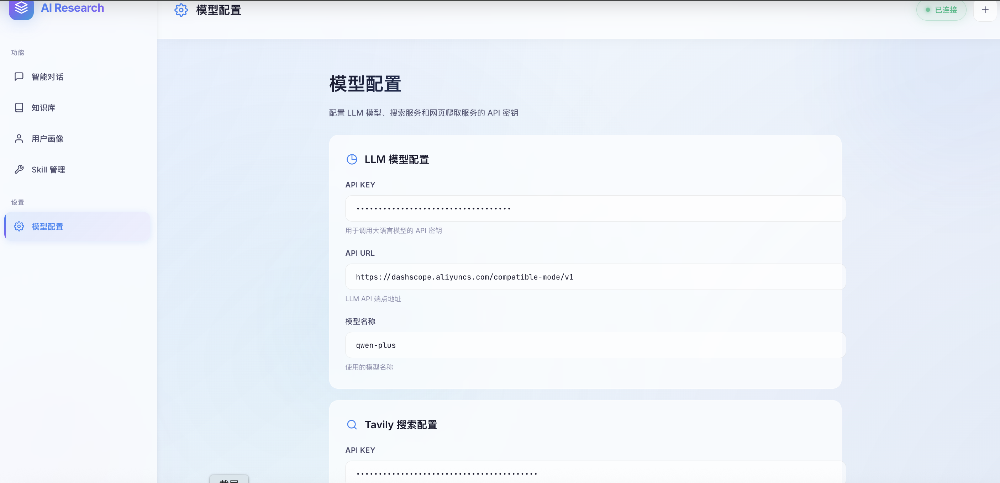

# DeepAgentForce

<p align="center">
  
</p>

<p align="center">
  <strong>新一代智能体协同系统 — 让 AI 真正成为你的智能助手</strong>
  <br>
  <em>Self-Evolving AI Agent with Modular Skills & Knowledge Intelligence</em>
</p>

<p align="center">
  
  
  
  
  
</p>

---

## 🎯 项目简介

**DeepAgentForce** 是一款基于大语言模型的**智能体协同系统**，它不仅仅是传统的 RAG 问答系统，更是一个具有**自我进化能力**的 AI 助手平台。

- 通过模块化的 **Agent Skills** 架构，系统支持无限扩展工具能力
- 通过**用户画像挖掘**技术，AI 会越用越懂你
- 通过**思考过程可视化**，你可以清晰看到 AI 是如何分析和解决问题的

---

## ✨ 核心特性

| 特性 | 传统 AI | DeepAgentForce |
|:-----|:-------:|:--------------:|
| 知识库问答 | ✅ | ✅ |
| 工具自动调用 | ❌ | ✅ |
| 模块化技能扩展 | ❌ | ✅ |
| 用户偏好学习 | ❌ | ✅ |
| 思考过程可视化 | ❌ | ✅ |
| 多会话管理 | ❌ | ✅ |
| 实时流式输出 | ❌ | ✅ |

---

## 🏗️ 系统架构

<div align="center">
  
</div>

---

## 🚀 快速开始

### 环境要求

| 依赖 | 版本要求 |
|------|---------|
| Python | 3.12+ |
| pip | 最新版 |

### 安装步骤

```bash
# 1. 克隆项目
git clone https://github.com/TW-NLP/DeepAgentForce
cd DeepAgentForce

# 2. 创建虚拟环境
conda create -n agent python=3.12 -y
conda activate agent

# 3. 安装依赖
pip install -r requirements.txt

# 中国用户可使用镜像加速
pip install -r requirements.txt \
  -i https://mirrors.aliyunyun.com/pypi/simple/ \
  --trusted-host=mirrors.aliyunyun.com
```

### 启动服务

```bash
# 终端 1：启动后端 API（默认端口 8000）
python main.py

# 终端 2：启动前端（任意端口）
cd static
python -m http.server 8080
```

访问 [http://localhost:8080](http://localhost:8080) 开始使用！

---

## 📸 功能展示

### 💬 智能对话

<div align="center">
  
</div>

### 🛠️ 可视化 Skill 管理

<div align="center">
  
</div>

### 📚 知识库管理

<div align="center">
  
</div>

### 🧠 思考过程可视化

```
🤔 初始化          →  接收用户任务，开始分析
   ↓
🔧 调用工具        →  识别需要调用的 Skill / 工具
   ↓
✅ 工具执行完成     →  获取执行结果
   ↓
🎯 生成回答        →  综合分析，生成最终回复
```

---

## 🛠️ Agent Skills 系统

### 什么是 Agent Skills？

Agent Skills 是 DeepAgentForce 的**模块化扩展系统**，每个 Skill 都是一个独立的功能模块，可以被 AI Agent 自动发现和调用。

### 预置 Skills

| Skill | 功能 | 使用场景 |
|-------|------|----------|
| 📄 **pdf-processing** | PDF 文档处理 | 提取文本、表格、合并/拆分、OCR |
| 🔍 **rag-query** | 企业知识库问答 | 私有文档智能问答 |
| 🌐 **web-search** | 联网搜索 | 实时获取网络信息 |

### 自定义 Skills

只需创建符合规范的目录结构：

```
src/services/skills/
└── my-skill/
    ├── SKILL.md          # 技能描述文件
    └── scripts/
        └── main.py       # 执行脚本
```

**SKILL.md 规范示例：**

```yaml
---
name: my-awesome-skill
description: 技能描述，说明何时使用
version: 1.0.0
---

# Skill 使用说明

## 何时使用
描述该技能适用的场景

## 执行命令

python scripts/main.py "<参数>"

```

---

## 👤 动态用户画像

系统会自动从对话中学习用户的：

- 🎯 **职业背景** — 了解用户的专业领域
- 💻 **技术偏好** — 掌握用户常用的技术栈
- 📝 **交互风格** — 适配用户的回答偏好
- 🧠 **上下文记忆** — 持续学习，越用越聪明

<div align="center">
  
</div>

---

## 📖 使用指南

### 1. 模型配置

首次使用需要配置 LLM：

1. 访问 [http://localhost:8080](http://localhost:8080)
2. 点击左侧 **"配置"**
3. 填写 LLM API Key、URL、Model Name
4. 保存配置

<div align="center">
  
</div>

### 2. 构建知识库

让 AI 学习你的私有知识：

1. 进入 **"知识库"** 页面
2. 拖拽或选择文档（PDF / Word / TXT / Markdown）
3. 系统自动向量化并建立索引

### 3. 开始对话

直接在对话框中提问，AI 会自动：

- 分析用户意图
- 判断是否需要调用工具
- 检索相关知识
- 生成最优回答

---

## 📡 API 文档

后端提供完整的 RESTful API，启动后访问 [http://localhost:8000/docs](http://localhost:8000/docs) 查看 Swagger 交互文档。

| Endpoint | 方法 | 说明 |
|----------|:----:|------|
| `/api/chat` | POST | 发送对话消息 |
| `/api/ws/stream` | WebSocket | 流式对话 |
| `/api/rag/documents/upload` | POST | 上传文档 |
| `/api/rag/query` | POST | 知识库问答 |
| `/api/history/saved` | GET | 获取历史会话 |
| `/api/skills` | GET / POST | Skills 管理 |
| `/api/person_like` | GET | 获取用户画像 |

---

## 🔧 配置说明

配置文件位于 `data/saved_config.json`，也可通过前端界面进行配置：

| 配置项 | 说明 | 默认值 |
|--------|------|--------|
| `LLM_API_KEY` | 大模型 API Key | — |
| `LLM_BASE_URL` | API 地址 | — |
| `LLM_MODEL_NAME` | 模型名称 | — |
| `EMBEDDING_MODEL` | Embedding 模型 | — |
| `MILVUS_HOST` | 向量数据库地址 | localhost |
| `MILVUS_PORT` | 向量数据库端口 | 19530 |

---

## 🗂️ 项目结构

```
DeepAgentForce/
├── main.py                          # 后端入口
├── requirements.txt                 # 依赖列表
├── README.md                        # 项目文档
├── config/
│   └── settings.py                  # 配置管理
├── src/
│   ├── api/
│   │   ├── routes.py                # 主路由
│   │   ├── websocket.py             # WebSocket 处理
│   │   └── skills_routes.py         # Skills 路由
│   ├── services/
│   │   ├── conversational_agent.py  # 对话 Agent
│   │   ├── person_like_service.py   # 用户画像
│   │   └── skills/                  # Agent Skills
│   │       ├── rag-query/
│   │       ├── web-search/
│   │       └── pdf-processing/
│   └── utils/                       # 工具函数
├── static/
│   ├── index.html                   # 主页面
│   ├── chat.js                      # 对话逻辑
│   └── skills.js                    # Skills 管理
├── images/                          # README 图片资源
└── data/
    ├── sessions/                    # 会话历史
    └── saved_config.json            # 用户配置
```

---

## 🤝 贡献指南

欢迎提交 Issue 和 Pull Request！

```bash
# 1. Fork 本项目

# 2. 创建特性分支
git checkout -b feature/awesome-feature

# 3. 提交更改
git commit -m 'Add awesome feature'

# 4. 推送分支
git push origin feature/awesome-feature

# 5. 提交 Pull Request
```

---

## 📄 License

本项目采用 **MIT License**，可自由使用、修改和分发，商用无忧。

---

## 🙏 致谢

本项目基于以下优秀的开源项目构建：

- [LangChain / LangGraph](https://github.com/langchain-ai/langchain) — Agent 开发框架
- [FastAPI](https://github.com/tiangolo/fastapi) — 高性能 Web 框架
- [Milvus](https://github.com/milvus-io/milvus) — 向量数据库

---

<p align="center">
  如果这个项目对你有帮助，欢迎 Star ⭐
  <br><br>
  <a href="https://github.com/TW-NLP/DeepAgentForce">
    
  </a>
</p>