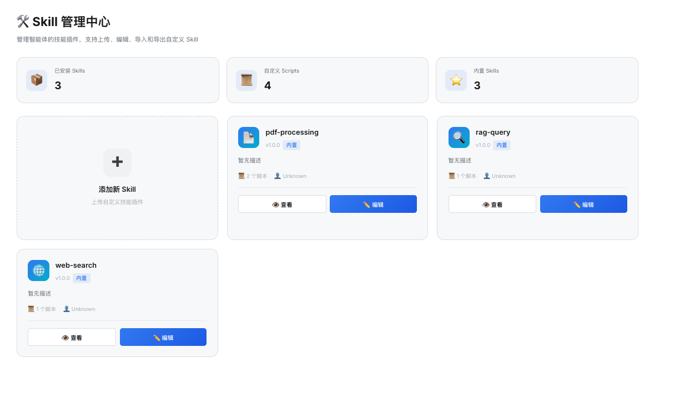
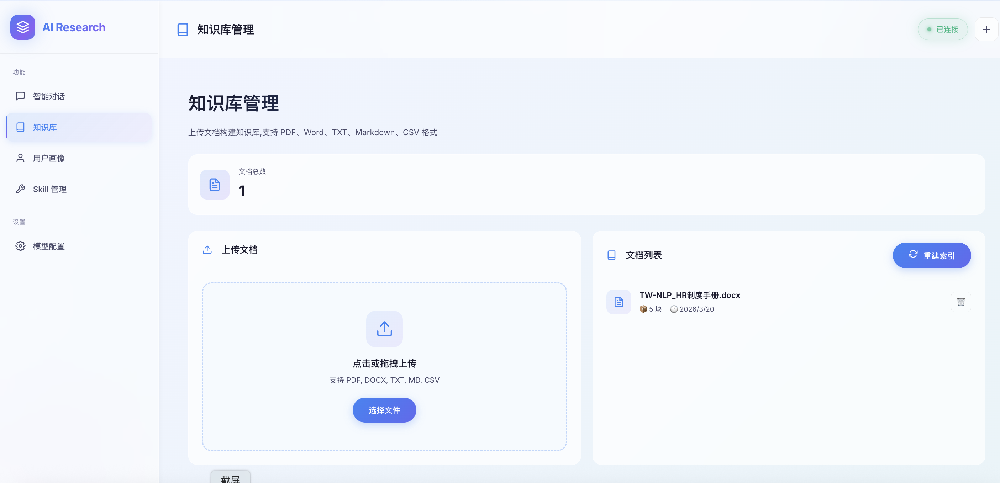
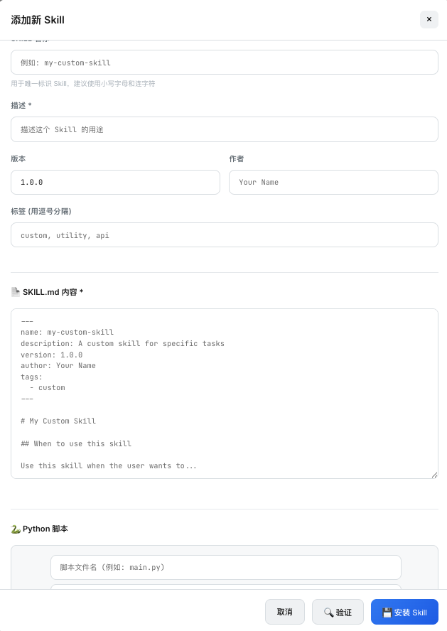

# DeepAgentForce

<p align="center">
  
</p>

<p align="center">
  <a href="https://python.org"></a>
  <a href="https://fastapi.tiangolo.com"></a>
  <a href="https://github.com/deepagents/deepagents"></a>
  <a href="./LICENSE"></a>
</p>

---

## 🌟 为什么选择 DeepAgentForce？

DeepAgentForce 是新一代**智能体协同系统**，它不仅仅是一个 RAG 系统，而是一个具有**自我进化能力**的 AI 助手：

| 特性 | 传统 RAG | DeepAgentForce |
|------|----------|----------------|
| 知识检索 | ✅ | ✅ |
| 工具调用 | ❌ | ✅ |
| 动态技能扩展 | ❌ | ✅ |
| 用户偏好学习 | ❌ | ✅ |
| 思考过程可视化 | ❌ | ✅ |

---

## ✨ 核心特性

### 1. 🛠️ Agent Skills 模块化扩展系统

**支持前端可视化管理的 Skill 扩展系统！**

<div align="center">
  
  <br>
  <em>可视化 Skill 管理中心</em>
</div>

#### 🎯 零配置即插即用

只需编写符合规范的 Skill，放入 `skills/` 目录即可，无需修改任何代码。

#### 📝 标准化的 Skill 规范

```yaml
---
name: my-awesome-skill
description: An awesome skill for specific tasks
version: 1.0.0
author: Your Name
tags:
  - custom
  - utility
---

# Skill 使用说明

## 何时使用

当用户想要...

## 可用脚本

### 1. main.py

执行命令：
```bash
python src/services/skills/my-awesome-skill/scripts/main.py --param value
```

**完整的管理功能：**
- 📦 查看所有已安装 Skills
- ➕ 上传自定义 Skill (SKILL.md + Python 脚本)
- ✏️ 在线编辑 Skill 配置和代码
- 🗑️ 删除不需要的 Skill
- 📤 导出为 JSON 分享给他人
- ✅ 上传前自动验证合法性

#### 📚 内置 Skills

项目预置了 3 个生产级 Skills，开箱即用：

| Skill | 功能 | 应用场景 |
|--------|------|----------|
| 📄 **pdf-processing** | PDF 文档处理 | 提取文本、表格、合并/拆分 PDF |
| 🔍 **rag-query** | 企业知识库问答 | 私有文档智能问答 |
| 🌐 **web-search** | 联网搜索 | 实时获取网络信息 |

---

### 2. 👤 动态用户画像 (Persona Mining)

**让 AI 越用越懂你！**

<div align="center">
  
  <br>
  <em>基于知识图谱的用户偏好分析</em>
</div>

系统会实时从对话中提取：

- 🎯 **职业背景** - 了解用户的专业领域
- 💻 **技术偏好** - 掌握用户常用的技术栈
- 📝 **交互风格** - 适配用户的回答偏好
- 🧠 **上下文记忆** - 持续学习，越用越聪明

---

### 3. 🌊 深度思考可视化 (Agent Observability)

**让 AI 的思考过程一览无余！**

```
🤔 Agent Start     →  接收用户任务
   ↓
🔧 Tool Call      →  调用 Skill/工具
   ↓
✅ Tool End       →  获取执行结果
   ↓
🎯 Final Response →  生成最终回答
```

<div align="center">
  
  <br>
  <em>实时展示 Agent 的每一个思考步骤</em>
</div>

---

## 🚀 快速开始

### 环境要求

- Python 3.12+
- Git

### 安装步骤

```bash
# 1. 克隆项目
git clone https://github.com/TW-NLP/DeepAgentForce
cd DeepAgentForce

# 2. 创建虚拟环境 (推荐)
conda create -n agent python=3.12 -y
conda activate agent

# 3. 安装依赖
pip install -r requirements.txt

# 中国用户可使用镜像
pip install -r requirements.txt -i https://mirrors.aliyun.com/pypi/simple/ --trusted-host=mirrors.aliyun.com
```

### 启动服务

```bash
# 终端 1: 启动后端 API (默认端口 8000)
python main.py
# 后端运行在 http://localhost:8000

# 终端 2: 启动前端 (可选择任意端口)
cd static
python -m http.server 8080
# 前端运行在 http://localhost:8080
```

> 💡 **智能端口适配**: 前端会自动检测后端地址！
> - 如果前端和后端在同一服务器，前端会自动获取 `/api/server_info` 获取后端地址
> - 如果后端在不同服务器，可通过 `?api=http://后端地址` 参数指定
> - 前端和后端端口可以任意选择，无需修改配置

### 多种部署方式

| 部署方式 | 前端命令 | 访问地址 |
|---------|---------|---------|
| 前后端同服务器 | `python -m http.server 8080` | http://localhost:8080 |
| 前端 8081，后端 8000 | `python -m http.server 8081` | http://localhost:8081 |
| 后端在不同服务器 | `python -m http.server 8080` | http://your-ip:8080?api=http://backend-ip:8000 |

### 🎉 开始体验

| 功能 | 访问地址 |
|------|----------|
| 智能对话 | http://localhost:8080 |
| 知识库管理 | 左侧导航"知识库" |
| 用户画像 | 左侧导航"用户画像" |
| **Skill 管理** | **左侧导航"Skill 管理"** ⭐ |

---

## 📖 使用指南

### 🔧 模型配置

首次使用需要配置 LLM：

1. 点击左侧 **"模型配置"**
2. 填写 LLM API Key、URL、Model Name
3. (可选) 配置 Tavily 搜索、Embedding 模型
4. 点击 **保存配置**

<div align="center">
  
  <br>
  <em>一键配置，即刻使用</em>
</div>

---

### 📚 构建知识库

让 AI 学习你的私有知识：

1. 进入 **"知识库"** 页面
2. 拖拽或选择文档 (PDF/Word/TXT/Markdown/CSV)
3. 系统自动向量化并索引

<div align="center">
  
  <br>
  <em>私有知识，一键入库</em>
</div>

---

### 💬 智能对话

开始与 AI 助手交互：

```
你: "对比一下本公司上市时间和百度上市时间，生成报告"
AI: [自动调用 RAG 检索相关文档] + [深度分析] + [生成报告]
```

<div align="center">
  
  <br>
  <em>智能理解，自动调用工具</em>
</div>

---

### 🛠️ 管理自定义 Skills

这是 DeepAgentForce 最强大的特性！


#### 上传新 Skill

1. 点击 **"➕ 添加新 Skill"** 卡片
2. 填写基本信息（名称、描述、版本）
3. 编写 SKILL.md 文档
4. 添加 Python 脚本
5. 点击 **"🔍 验证"** 检查合法性
6. 点击 **"💾 安装 Skill"** 完成上传

<div align="center">
  
  <br>
  <em>可视化上传，无需代码</em>
</div>

#### 导出分享

点击任意 Skill 的 **"导出"** 按钮，生成 JSON 文件分享给他人。

---

## 🏗️ 系统架构

```
┌─────────────────────────────────────────────────────────────┐
│                      Frontend (HTML/JS)                      │
│  ┌─────────┐  ┌─────────┐  ┌─────────┐  ┌─────────────┐    │
│  │  Chat   │  │Knowledge│  │ Persona │  │   Skills    │    │
│  └────┬────┘  └────┬────┘  └────┬────┘  └──────┬──────┘    │
└───────┼───────────┼────────────┼──────────────┼────────────┘
        │           │            │              │
        └───────────┴─────┬──────┴──────────────┘
                          │
                    ┌─────▼─────┐
                    │  FastAPI  │
                    │   Backend │
                    └─────┬─────┘
         ┌───────────────┼───────────────┐
         │               │               │
    ┌────▼────┐    ┌─────▼─────┐   ┌────▼────┐
    │  RAG    │    │  Persona  │   │ Skills  │
    │ Engine  │    │  Mining   │   │ Manager │
    └─────────┘    └───────────┘   └─────────┘
         │                          │
    ┌────▼──────────────────────────▼────┐
    │         DeepAgents Framework        │
    │  ┌─────────────────────────────┐   │
    │  │    LangGraph Agent         │   │
    │  │  + Tools + Skills + Memory │   │
    │  └─────────────────────────────┘   │
    └────────────────────────────────────┘
```

---

## 📡 API 文档

后端提供完整的 RESTful API：

| Endpoint | 方法 | 说明 |
|----------|------|------|
| `/api/server_info` | GET | 获取服务器信息（供前端自动适配） |
| `/api/chat` | POST | 发送对话消息 |
| `/api/rag/documents/upload` | POST | 上传文档 |
| `/api/rag/query` | POST | 知识库问答 |
| `/api/skills` | GET | 获取 Skills 列表 |
| `/api/skills/install` | POST | 安装新 Skill |
| `/api/person_like` | GET | 获取用户画像 |

完整 API 文档请访问：**http://localhost:8000/docs**

---

## 🤝 贡献指南

欢迎提交 Issue 和 Pull Request！

1. Fork 本项目
2. 创建特性分支 (`git checkout -b feature/awesome-feature`)
3. 提交更改 (`git commit -m 'Add awesome feature'`)
4. 推送分支 (`git push origin feature/awesome-feature`)
5. 提交 Pull Request

---

## 📄 License

MIT License - 自由使用，商用无忧！

---

## 📬 联系我们

- 💬 微信: NLP技术交流群

<p align="center">
  
</p>

---

<p align="center">
  <strong>让 AI 成为你最好的伙伴</strong><br>
  ⭐ Star us on GitHub!
</p>
